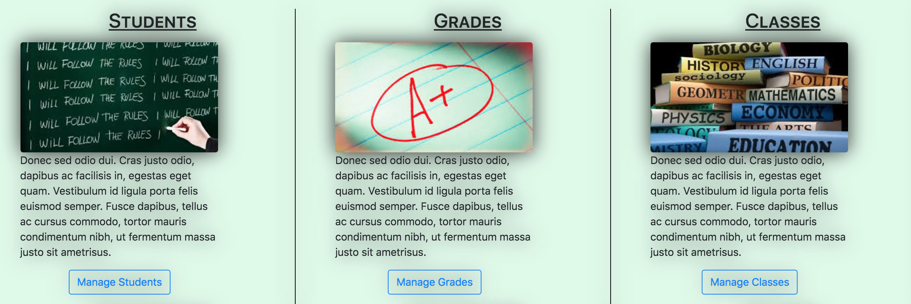
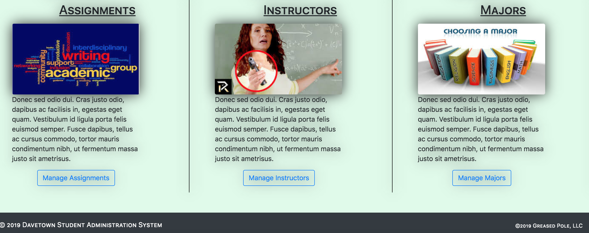

# Angular 8.2 Web-based Administration Service

# ___________________________________________________________
# Description

This Angular project is a fully functional web frontend administration system. 

Additionally, it can be leveraged as a very detailed template for other uses.

* Starting the Application

    * Backend

        * I use the Sails web framework (0.12.13) as an API server.

            * [Sails as a Backend Framework](https://github.com/techlozenge/sails-student-api) (used by this Angular project)

            * [Sails as a Frontend Framework](https://github.com/techlozenge/sails-student-frontend-v2) (replaces this Angular project and listens on port 3800)

            A document named [SETUP-SAILS-DB-&-FRONTEND-ENDPOINTS](https://github.com/techlozenge/sails-student-api/blob/master/SETUP-SAILS-DB-%26-FRONTEND-ENDPOINTS) exists in the front- and backend Sails projects and it describes their setup.

        * From the CLI, use 'sails lift' (listens on port 3700) But as long as you're using RESTful API calls you can use any end-point api. Simply modify the frontend and its associated logic to use the appropriate request/response data.

        * Here are some example HTTP calls to end-points:
            * http.GET: table records listing: http://localhost:1337/student
            * http.ADD: table record: http://localhost:1337/student
            * http.GET: fetch record: http://localhost:1337/student/4
            * http.PUT: update record: http://localhost:1337/student/4
            * http.DELETE: remove record: http://localhost:1337/student/4

    * Frontend 

        * Angular CLI (listens on port 4200): 

            ng serve --open

* Framework
    * Angular 8

*  Authentication
    * There is currently no authentication built into this system

* Styling
    * Bootstrap 4 (see index.html)
    * CSS (styles.css)

* Animation
    * Angular 8 fade-in-animation

* Landing Page
    * home

* Navigation
    * navigation (includes a web search method in the navigation bar)

* Admin Components
    * Students
    * Student Form
    * Grades
    * Grades Form
    * Classes
    * Class Form
    * Assignments
    * Assignment Form
    * Instructors
    * Instructor Form
    * Majors
    * Major Form
    * Major-Classes Cross-reference
    * Major-Class Cross-reference Form
    * Student-Classes Cross-reference
    * Student-Class Cross-reference Form

* Service
    * data.service.ts (low-level API calls)

* Routing
    * routing.module.ts

* Popup Dialog
    * delete-comfirm.component

# ___________________________________________________________
# Launching the Sails Backend & Angular Frontend

## How to launch the sails backend
My data is stored locally in a MySQL DB and I've hooked up a Sails backend to act as an API endpoint server for the database. 

Once your DB is running and loaded with data and Sails is all set up, and you're in the Sails project folder, at the command line, type: 

    sails lift

This will launch the Sails backend listening on the port you assigned (mine is 1337).

You can test your API endpoints by opening your browser and typing something like "http://localhost:1337/student" in the address bar. 

## How to launch the angular frontend
Once the backend API endpoints are availale, and you're in the angular project folder, from the command line, type: 

    ng serve --open

This will compile your project and open a window in your browser on the landing page.

If you don't use the --open then you can launch your angular landing page by typing http://localhost:4200 in your address bar. 

# ___________________________________________________________
# Screen Shots

**Landing Page (top half)** 

**Student List**

**Student Screen** 

**Delete Confirmation Dialog** 

# ___________________________________________________________
# Helpful Links

* Stack
    * [Angular](https://angular.io/guide/quickstart)  - an all-encompassing JavaScript framework that is frequently used by developers all over the world for building web, desktop, and mobile applications.
    * [Sails](https://sailsjs.com/get-started) - MVC framework for Node.js for building practical, production-ready apps
    * [MySQL](https://www.mysql.com/) - MySQL is a relational database management system based on SQL. The application is used for a wide range of purposes, including data warehousing, e-commerce, and logging applications. The most common use for mySQL however is for the purpose of a web database

* Libraries
    * [jquery](https://jquery.com/) jQuery is a fast, small, and feature-rich JavaScript library.
    * [Node.js](https://nodejs.org/en/) Node.js® is a JavaScript runtime built on Chrome's V8 JavaScript engine.
    * [Bootstrap 4](https://getbootstrap.com/) Bootstrap is an open source toolkit for developing with HTML, CSS, and JS.
        * [Bootstrap Bootply](http://upgrade-bootstrap.bootply.com/) Converts BS3 to BS4
        * [Bootstrap Select](https://silviomoreto.github.io/bootstrap-select/) utilizes Bootstrap's dropdown.js to style and bring additional functionality to standard select elements
    * [Angular DataTables](https://l-lin.github.io/angular-datatables/#/getting-started)  Angular Structural framework for dynamic web apps +  DataTables jQuery plug-in for complex HTML tables
    * [Font Awesome](https://fontawesome.com/icons?d=gallery&m=free) The icons used by this frontend

* Applications and Web Apps
    * [npmjs](https://www.npmjs.com/) npm is the package manager for JavaScript
    * RxJS
        * [Learn RxJS](https://www.learnrxjs.io/) 
        * [RxJS Primer](https://www.learnrxjs.io/concepts/rxjs-primer.html) 
    * [iTerm 2](https://www.iterm2.com/) iTerm2 is a replacement for Terminal and the successor to iTerm. It works on Macs with macOS
    * [Online JSON Validator](http://jsonlint.com/)
    * [Express](https://expressjs.com/) A web framework that let’s you structure a web application to handle multiple different http requests at a specific url. Express is a minimal, open source and flexible Node.js web app framework designed to make developing websites, web apps, & API’s much easier.
    * [Sequel PRO](https://www.sequelpro.com/) Database Administrator
    * [Postman](https://www.getpostman.com/) complete API development environment for API developers (performs GET, POST, DELETE, etc API calls)
    * [Homebrew](https://docs.brew.sh/) The missing package manager for macOS
    * [Gulp](https://gulpjs.com/) Automate tasks in your workflow
    * [Regular Expressions](http://regexr.com/) Pattern matching on steroids. Lots of steroids
    * [lorem ipsum generator](https://loremipsum.io/) Generate placeholder text commonly used in the graphic, print, and publishing industries for previewing layouts and visual mockups.
    * [Loading.io](https://loading.io/) Build your own AJAX loading icons
    * [PlaceHolder Images](https://placeholder.com/) Link your page to their blank images
    * [Mozilla Developer Network](https://developer.mozilla.org/en-US/)
    * [Programmable Web](https://www.programmableweb.com/category/all/apis)
    * [MD5 Hash Generator](http://www.md5hashgenerator.com/)
    * [Google Hosted Libraries](https://developers.google.com/speed/libraries/)
    * [CSS3 Button Generator](https://www.designrush.com/resources/css3buttongenerator)

# ___________________________________________________________
# TO-DO
    
* Need to upgrade Sails to v1.0 (lots of breaking changes)

# ___________________________________________________________
# Change Log

## September 2019 

* Upgraded to from Angular 5.2 to 8.2

        Angular CLI: 8.3.6
        Node: 10.10.0
        OS: darwin x64
        Angular: 8.2.8
        ... animations, common, compiler, compiler-cli, core, forms
        ... language-service, platform-browser, platform-browser-dynamic
        ... platform-server, router

        Package                           Version
        -----------------------------------------------------------
        @angular-devkit/architect         0.803.6
        @angular-devkit/build-angular     0.803.6
        @angular-devkit/build-optimizer   0.803.6
        @angular-devkit/build-webpack     0.803.6
        @angular-devkit/core              8.3.6
        @angular-devkit/schematics        8.3.6
        @angular/cdk                      8.2.1
        @angular/cli                      8.3.6
        @angular/material                 8.2.1
        @ngtools/webpack                  8.3.6
        @schematics/angular               8.3.6
        @schematics/update                0.803.6
        rxjs                              6.5.3
        typescript                        3.5.3
        webpack                           4.39.2

* Added standard footer component across all pages

## March 2018: 
Converted to Angular 5 & misc. bug fixes 

## June 2018: 
Styled Delete Confirm Component

## July 2018:
Injected ID number into the Delete Confirm Component

Included a string along with the id in the Delete Confirm Component so the popup could include a descriptor of what's being deleted and not just an id number

## August 2018:
Restyled README.md to document this project

Completed upgrade to Bootstep 4. Temporarily removed datatables.net so ensure a clean Bootstrap 4 upgrade and styles. Added a working web search to the navigation bar

Added simple ascending/descending table column sorts to all tables (see assets/js folder)

Implemented Font Awesome to replace the glyphicons that were dropped from BS4

Added 'piped' current date to left side of navigation bar

Minor style upgrades

## September 2018:
Added "Angular_5_and_Associated_Technologies" Word document. The intent of this document is to familiarize backend team members with Angular: What it is, how to use it, and the supporting technologies it leverages

