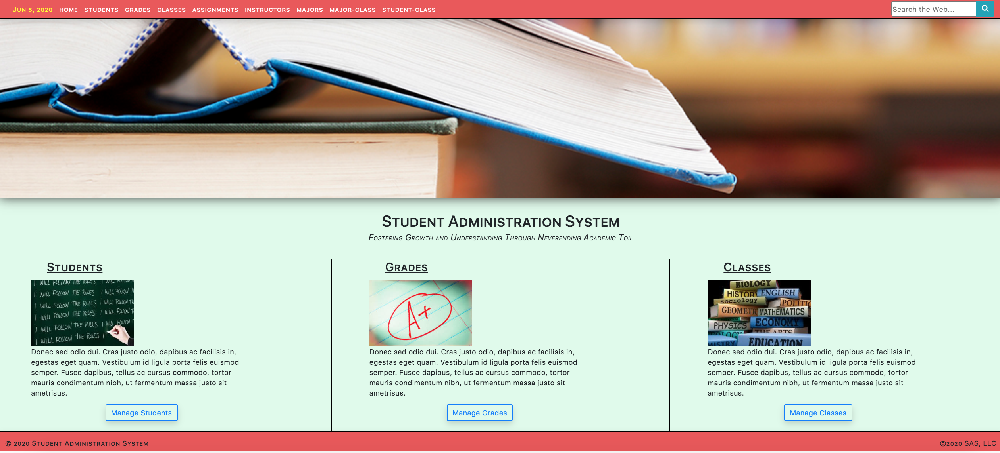
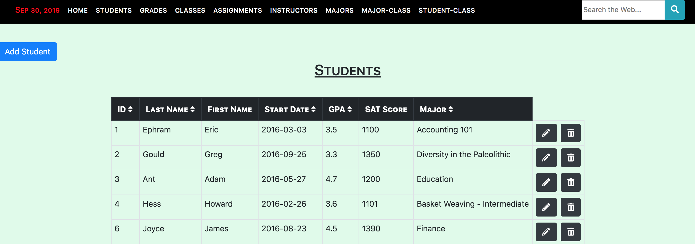
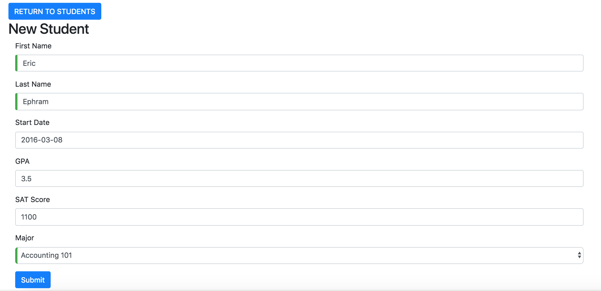
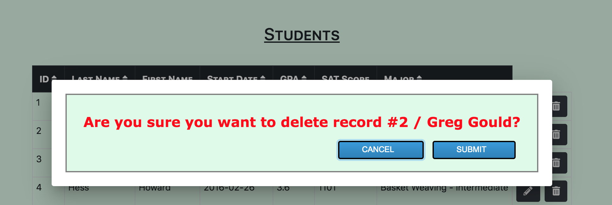

# Angular 5 Goodness CRUD Frontend Admin System

# _________________________________________________________________
# Description:

This project administers a relatively straightforward school database. 

The application leverages a MySQL database accessed via API calls to a separate Sails framework. The API calls are made via HTTP web requests to Sails which manages the CRUD operations (currently I'm running the Sails backend on my local server to simulate web API calls).

* Starting the Application
    * Backend CLI: Not Included Here however, I use 'sails lift (listens on port 3700)'
        * As long as you're using RESTful API calls you can use any end-point. Simply modify the frontend to match the response data.

    * Frontend CLI: ng serve --open (listens on port 4200)

* Application Styling
    * Angular 5 
    * Bootstrap 4
    * styles.css

* Application Landing Page
    * Home

* Navigation Component
    * Navigation (includes web search method in nav bar)

* Admin Components: 
    * Student
    * Student Form
    * Grades
    * Grades Form
    * Classes
    * Classes Form
    * Assignments
    * Assignments Form
    * Instructors
    * Instructors Form
    * Majors
    * Majors Form
    * Major-Class Cross-ref
    * Major-Class Cross-ref Form
    * Student-Class Cross-ref
    * Student-Class Cross-ref Form

* Animations
    * fade-in-animation

* Service
    * data.service (all low-level API calls)

* Routing
    * routine.module

* Popup Dialog
    * delete-comfirm.component

Change log below helpful links section.

# _________________________________________________________________
# Helpful Links

* Stack
    * [Angular](https://angular.io/guide/quickstart)
    * [Sails](https://sailsjs.com/get-started)
    * [MySQL](https://www.mysql.com/) Hosted on my local to simulate API calls but as long as your calls are RESTful, it doesn't matter

* Libraries
    * [jquery](https://jquery.com/) jQuery is a fast, small, and feature-rich JavaScript library.
    * [Node.js](https://nodejs.org/en/) Node.js® is a JavaScript runtime built on Chrome's V8 JavaScript engine.
    * [Bootstrap 4](https://getbootstrap.com/) Bootstrap is an open source toolkit for developing with HTML, CSS, and JS.
        * [Bootstrap Bootply](http://upgrade-bootstrap.bootply.com/) Converts BS3 to BS4
        * [Bootstrap Select](https://silviomoreto.github.io/bootstrap-select/) utilizes Bootstrap's dropdown.js to style and bring additional functionality to standard select elements
    * [Datatables.net](https://datatables.net/) Add advanced interaction controls to your HTML tables
    * [Font Awesome](https://fontawesome.com/icons?d=gallery&m=free)

* Applications and Web Apps
    * [npmjs.com](https://www.npmjs.com/) npm is the package manager for JavaScript
    * [iTerm 2](https://www.iterm2.com/) iTerm2 is a replacement for Terminal and the successor to iTerm. It works on Macs with macOS
    * [Sequel PRO](https://www.sequelpro.com/) Database Administrator
    * [Postman](https://www.getpostman.com/) complete API development environment for API developers (performs GET, POST, DELETE, etc API calls)
    * [Homebrew](https://docs.brew.sh/) The missing package manager for macOS
    * [Gulp](https://gulpjs.com/) Automate tasks in your workflow
    * [Regular Expressions](http://regexr.com/) Pattern matching on steroids. Lots of steroids
    * [lorem ipsum generator](https://loremipsum.io/) Generate placeholder text commonly used in the graphic, print, and publishing industries for previewing layouts and visual mockups.
    * [Loading.io](https://loading.io/) Build your own AJAX loading icons
    * [PlaceHolder Images](https://placeholder.com/) Link your page to their blank images
    * [Mozilla Developer Network](https://developer.mozilla.org/en-US/)
    * [Programmable Web](https://www.programmableweb.com/category/all/apis)
    * [MD5 Hash Generator](http://www.md5hashgenerator.com/)
    * [Google Hosted Libraries](https://developers.google.com/speed/libraries/)
    * [CSS3 Button Generator](https://www.designrush.com/resources/css3buttongenerator)

# _________________________________________________________________
# Change Log

## 2018-3-3: 
Converted to Angular 5 & misc. bug fixes 

## 2018-6-8: 
Styled Delete Confirm Component

## 2018-7-19: 
Injected ID number into the Delete Confirm Component

## 2018-7-23: 
Included a string along with the id in the Delete Confirm Component so the popup could include a descriptor of what's being deleted and not just an id number.

## 2018-8-3: 
Upgrading to Bootstrap 4. Temporarily removed datatables.net so ensure a clean Bootstrap 4 upgrade and styles. Added a working web search to the navigation bar.

## WIP (August 2018): 
Continuing Bootstrap 4 upgrades
Added simple ascending/descending table column sorts to all tables
Implemented Font Awesome to replace the glyphicons that were dropped from BS4