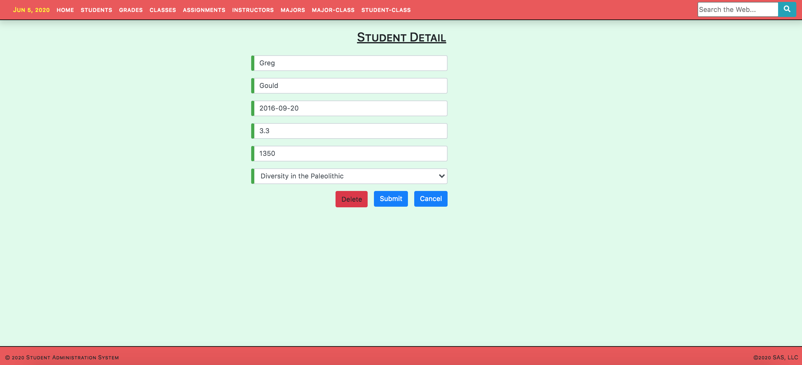

# Angular 8.2 Demonstration Frontend Web Administration Service

# ____________________
# Description

This is an Angular demo project that provides a fully functional frontend web administration system and it can be leveraged as a detailed template for other uses.

This demo project uses Angular Material Tables that leverages both  MatSort and MatPagination.

* Starting the Application

    * Backend

        * The backend uses the Sails web framework (0.12.13) as an API server that serves MySQL data.

            * [Sails as a Backend Framework](https://github.com/techlozenge/sails-student-api) (used by this Angular project)

            * [Sails as a Frontend Framework](https://github.com/techlozenge/sails-student-frontend-v2) (replaces this Angular project and listens on port 3800)

            A document named [SETUP-SAILS-DB-&-FRONTEND-ENDPOINTS](https://github.com/techlozenge/sails-student-api/blob/master/SETUP-SAILS-DB-%26-FRONTEND-ENDPOINTS) exists in the front- and backend Sails projects and it describes their setup.

        * From the command line, use 'sails lift' (listens on port 3700) But as long as you're using RESTful API calls you can use any end-point api. Simply modify the frontend and its associated logic to use the appropriate request/response data.

        * Here are some example HTTP calls to end-points:
            * http.GET: table records listing: http://localhost:1337/student
            * http.ADD: table record: http://localhost:1337/student
            * http.GET: fetch record: http://localhost:1337/student/4
            * http.PUT: update record: http://localhost:1337/student/4
            * http.DELETE: remove record: http://localhost:1337/student/4

    * Frontend 

        * Angular CLI (listens on port 4200): 

            ng serve --open

* Framework

    Angular CLI: 8.3.6
    Node: 10.10.0
    OS: darwin x64
    Angular:
    @angular-devkit/architect    0.803.6
    @angular-devkit/core         8.3.6
    @angular-devkit/schematics   8.3.6
    @schematics/angular          8.3.6
    @schematics/update           0.803.6
    rxjs                         6.4.0

*  Authentication
    * There is currently no authentication built into this system

* Styling
    * Bootstrap 4 (see index.html)
    * CSS (see styles.css)

* Animation
    * Angular fade-in-animation

* Landing Page
    * home

* Navigation
    * navigation (includes web search in the navigation bar)

* Admin Components
    * Students
    * Student Form
    * Grades
    * Grades Form
    * Classes
    * Class Form
    * Assignments
    * Assignment Form
    * Instructors
    * Instructor Form
    * Majors
    * Major Form
    * Major-Classes Cross-reference
    * Major-Class Cross-reference Form
    * Student-Classes Cross-reference
    * Student-Class Cross-reference Form

* Service
    * data.service.ts (low-level API calls)

* Routing
    * routing.module.ts

* Popup Dialog
    * delete-comfirm.component

# ____________________
# Launching the Sails Backend & Angular Frontend

## How to launch the sails backend
My data is served locally in a MySQL DB and I've hooked up a Sails backend to act as an API endpoint server for the database. 

Once your DB is running and loaded with data and Sails is all set up, and you're in the Sails project folder, at the command line, type: 

    sails lift

This will launch the Sails backend listening on the port you assigned (mine is 1337).

You can test your API endpoints by opening your browser and typing something like "http://localhost:1337/student" in the address bar. 

## How to launch the angular frontend
Once the backend API endpoints are availale, and you're in the angular project folder, from the command line, type: 

    ng serve --open

This will compile your project and open a window in your browser on the landing page.

If you don't use the --open then you can launch your angular landing page by typing http://localhost:4200 in your address bar. 

# ____________________
# Screen Shots

**Landing Page** 

**Student Listing**

**Add Student Screen** 

**Edit Student Screen** 

**Delete Confirmation Dialog** 

# ____________________
# Helpful Links

* Stack
    * [Angular](https://angular.io/guide/quickstart)  - an all-encompassing JavaScript framework that is frequently used by developers all over the world for building web, desktop, and mobile applications.
    * [Sails](https://sailsjs.com/get-started) - MVC framework for Node.js for building practical, production-ready apps
    * [MySQL](https://www.mysql.com/) - MySQL is a relational database management system based on SQL. The application is used for a wide range of purposes, including data warehousing, e-commerce, and logging applications. The most common use for mySQL however is for the purpose of a web database

* Libraries
    * [TypeScript](https://www.typescriptlang.org/) TypeScript is an open-source programming language developed and maintained by Microsoft. It is a strict syntactical superset of JavaScript, and adds optional static typing to the language. TypeScript is designed for development of large applications and transcompiles to JavaScript.
    * [jquery](https://jquery.com/) jQuery is a fast, small, and feature-rich JavaScript library.
    * [Node.js](https://nodejs.org/en/) Node.js® is a JavaScript runtime built on Chrome's V8 JavaScript engine.
    * [Bootstrap](https://getbootstrap.com/) Bootstrap is an open source toolkit for developing with HTML, CSS, and JS.
        * [Bootstrap Bootply](http://upgrade-bootstrap.bootply.com/) Converts BS3 to BS4
        * [Bootstrap Select](https://silviomoreto.github.io/bootstrap-select/) utilizes Bootstrap's dropdown.js to style and bring additional functionality to standard select elements
    * [Angular DataTables](https://l-lin.github.io/angular-datatables/#/getting-started)  Angular Structural framework for dynamic web apps +  DataTables jQuery plug-in for complex HTML tables
    * [Font Awesome](https://fontawesome.com/icons?d=gallery&m=free) The icons used by this frontend

* Applications and Web Apps
    * [npmjs](https://www.npmjs.com/) npm is the package manager for JavaScript
    * RxJS
        * [Learn RxJS](https://www.learnrxjs.io/) 
        * [RxJS Primer](https://www.learnrxjs.io/concepts/rxjs-primer.html) 
    * [iTerm 2](https://www.iterm2.com/) iTerm2 is a GPL-licensed terminal emulator for macOS. It was derived from and has mostly supplanted the earlier "iTerm" application. iTerm2 supports operating system features such as window transparency, full-screen mode, split panes, Exposé Tabs, Growl notifications, and standard keyboard shortcuts.
    * [Online JSON Validator](http://jsonlint.com/)
    * [Express](https://expressjs.com/) A web framework that let’s you structure a web application to handle multiple different http requests at a specific url. Express is a minimal, open source and flexible Node.js web app framework designed to make developing websites, web apps, & API’s much easier.
    * [Sequel PRO](https://www.sequelpro.com/) Database Administrator
    * [Postman](https://www.getpostman.com/) complete API development environment for API developers (performs GET, POST, DELETE, etc API calls)
    * [Homebrew](https://docs.brew.sh/) The missing package manager for macOS
    * [Gulp](https://gulpjs.com/) Automate tasks in your workflow
    * [Regular Expressions](http://regexr.com/) Pattern matching on steroids. Lots of steroids
    * [lorem ipsum generator](https://loremipsum.io/) Generate placeholder text commonly used in the graphic, print, and publishing industries for previewing layouts and visual mockups.
    * [Loading.io](https://loading.io/) Build your own AJAX loading icons
    * [PlaceHolder Images](https://placeholder.com/) Link your page to their blank images
    * [Mozilla Developer Network](https://developer.mozilla.org/en-US/)
    * [Programmable Web](https://www.programmableweb.com/category/all/apis)
    * [MD5 Hash Generator](http://www.md5hashgenerator.com/)
    * [Google Hosted Libraries](https://developers.google.com/speed/libraries/)
    * [CSS3 Button Generator](https://www.designrush.com/resources/css3buttongenerator)

# ____________________
# TO-DO
    
* Need to upgrade Sails to v1.0 (lots of breaking changes)

# ____________________
# Change Log

## Feb-June 2020

* Cleaned up code
* Misc Changes to UI to adjust & clean up
* Began working on export to Excel using XLSX starting with Student component

## January 2020

* Improved routing and clean up code
* Implemented clicking on a summary table row takes user to the edit screen
* Removed all of the old-style edit/delete buttons from the summary screens and moved them into the edit detail screens
* Made the delete button only visible and enabled when in edit mode

## December 2019

* Upgraded all of the form screens to provide a more streamlined UX

## October 2019

* Upgraded all data summary tables to Mat Tables using MatSort and MatPagination

## September 2019 

* Upgraded from Angular 5.2 to 8.2

        Angular CLI: 8.3.6
        Node: 10.10.0
        OS: darwin x64
        Angular: 8.2.8
        ... animations, common, compiler, compiler-cli, core, forms
        ... language-service, platform-browser, platform-browser-dynamic
        ... platform-server, router

        Package                           Version
        -----------------------------------------------------------
        @angular-devkit/architect         0.803.6
        @angular-devkit/build-angular     0.803.6
        @angular-devkit/build-optimizer   0.803.6
        @angular-devkit/build-webpack     0.803.6
        @angular-devkit/core              8.3.6
        @angular-devkit/schematics        8.3.6
        @angular/cdk                      8.2.1
        @angular/cli                      8.3.6
        @angular/material                 8.2.1
        @ngtools/webpack                  8.3.6
        @schematics/angular               8.3.6
        @schematics/update                0.803.6
        rxjs                              6.5.3
        typescript                        3.5.3
        webpack                           4.39.2

* Added standard footer component across all pages
* Moved to Bootstrap 4.3.1

## March 2018: 
Converted to Angular 5 & misc. bug fixes 

## June 2018: 
Styled Delete Confirm Component

## July 2018:
Injected ID number into the Delete Confirm Component

Included a string along with the id in the Delete Confirm Component so the popup could include a descriptor of what's being deleted and not just an id number

## August 2018:
Restyled README.md to document this project

Completed upgrade to Bootstep 4. Temporarily removed datatables.net so ensure a clean Bootstrap 4 upgrade and styles. Added a working web search to the navigation bar

Added simple ascending/descending table column sorts to all tables (see assets/js folder)

Implemented Font Awesome to replace the glyphicons that were dropped from BS4

Added 'piped' current date to left side of navigation bar

Minor style upgrades

## September 2018:
Added "Angular_5_and_Associated_Technologies" Word document. The intent of this document is to familiarize backend team members with Angular: What it is, how to use it, and the supporting technologies it leverages

# ___________________________________________________________
# Appendix

## MacOS Command-Level Tools, Package Managers, & Languages

**iTerm2:**
https://iterm2.com/ 
What is it: iTerm2 is a replacement for Terminal and the successor to iTerm. iTerm2 brings the terminal into the modern age with features you never knew you always wanted.
Check: Go to the Mac Launchpad and see if it is there
Install Prerequisites: None
Install: https://iterm2.com/downloads.html - Download and install the app.

**Homebrew:** 
https://brew.sh/ 
What is it: Homebrew is a free and open-source software package management system.
Note: Homebrew installs Python 3 but your Mac may have both python and ruby already installed
Check: brew -v
Install Prerequisites: iTerm2
Install: /usr/bin/ruby -e "$(curl -fsSL https://raw.githubusercontent.com/Homebrew/install/master/install)"
Note: Homebrew installs python. You can check to see if you have it by typing:

python --version
Python 2.7.16
(and)
python3 --version
Python 3.6.4

You can also install ruby via Homebrew by typing: brew install ruby

You can learn more about python at https://www.python.org/
You can learn more about ruby at https://www.ruby-lang.org/en/

**.bash_profile**
What is it: Contains specific settings that are executed when a user logs in to the system
Located in: /Users/[username] e.g. /Users/johndoe/.bash_profile

Note: the ‘.’ prefixing the file name means the file is hidden. If you perform an ‘ls’ you won’t see it. However, perform ‘ls -la’ to see all files including hidden files.

Here is a sample .bash_profile (the ‘#’ is a comment):

	# NOTE: To refresh this file, type "source .bash_profile" without the quotes
	export PS1="\w @ (\u) $ "
	alias c='clear'
	alias filetree="ls -R | grep ":$" | sed -e 's/:$//' -e 's/[^-][^\/]*\//--/g' -e 's/^/ /' -e 's/-/|/'"
	JAVA_HOME=$(/usr/libexec/java_home)
	export JAVA_HOME

**Node.js:** 
https://nodejs.org/en/ 
What is it: Node.js is an open-source, cross-platform, JavaScript runtime environment that executes JavaScript code outside of a browser
Check: node -v
Install Prerequisites: iTerm2, brew
Install: brew update; brew install node
Wait. Homebrew has to download some files and install them. But that’s it.

**npm (Node Program Manager):** 
https://www.npmjs.com/ 
What is it: npm is a package manager for the JavaScript programming language. 
Check: npm -v
Install Prerequisites: iTerm2, brew
Install: npm is installed with Node.js

**git:**
https://git-scm.com/ 
Git is a distributed version-control system for tracking changes in source code during software development. It is designed for coordinating work among programmers, but it can be used to track changes in any set of files. Its goals include speed, data integrity, and support for distributed, non-linear workflows
Check: git --version
Install Prerequisites: iTerm2, brew, node/npm
Install: https://git-scm.com/download/mac - Download and install on Mac OS

**Typescript:**
https://www.typescriptlang.org/ 
TypeScript is an open-source programming language developed and maintained by Microsoft. It is a strict syntactical superset of JavaScript, and adds optional static typing to the language. TypeScript is designed for development of large applications and transcompiles to JavaScript
Check: tsc -v
Install Prerequisites: iTerm2, brew, node/npm
Install: sudo npm install -g typescript

**Maven:** 
https://maven.apache.org/ 
What is it: Maven is a build automation tool used primarily for Java projects
Check: mvn -v
Install Prerequisites: iTerm2, brew
Install: brew install maven 
Go Here: ~/.m2
See if settings.xml exists. If not then add it.

**Java:** 
What is it: Java is a general-purpose programming language that is class-based, object-oriented, and designed to have as few implementation dependencies as possible
Check: java -version
Install Prerequisites: None
Install: https://java.com/en/download/help/mac_install.xml & follow instructions.

**ng (Angular):**
https://angular.io/ 
Angular is a TypeScript-based open-source web application framework led by the Angular Team at Google and by a community of individuals and corporations.
Check: ng —version
Install Prerequisites: iTerm2, node/npm
Install: npm install -g @angular/cli

**vi (visual text editor):**
What is it: vi is a screen-oriented text editor originally created for the Unix operating system. The portable subset of the behavior of vi and programs based on it, and the ex editor language supported within these programs, is described by the Single Unix Specification and POSIX
Check: N/A
Install: Comes preinstalled with MacOS
Note: If you haven’t used vi in the past then I strongly suggest that you find a tutorial on the web before starting.
