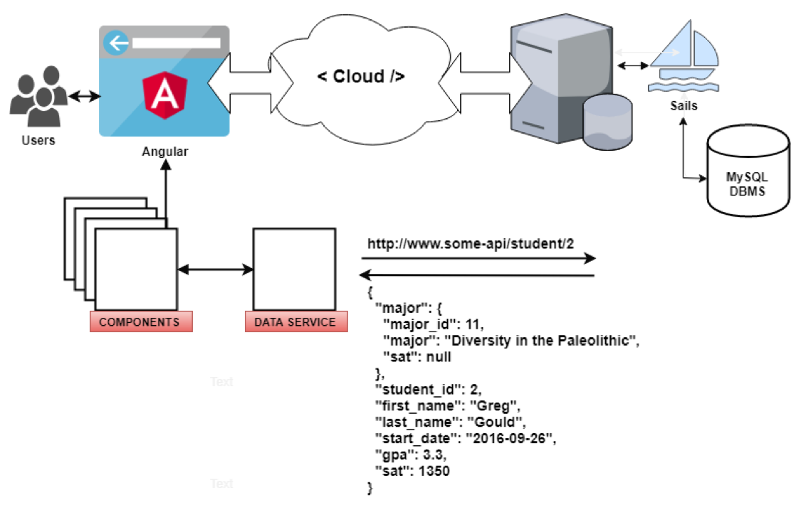
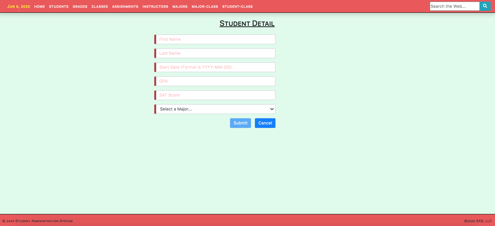
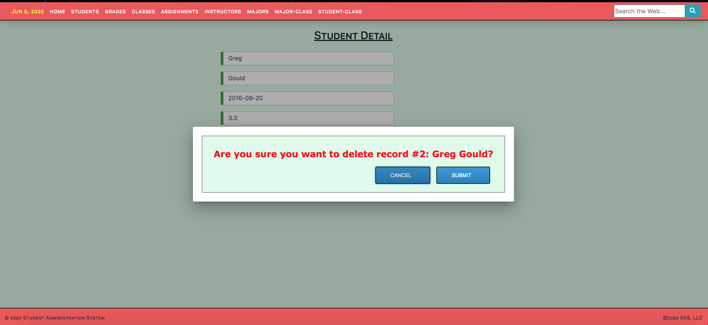

# Angular 8.2 Demonstration Frontend Web Administration Service

# ____________________
# Description

This is an Angular demo project that provides a fully functional frontend web administration system and it can be leveraged as a detailed template for other uses.

This demo project uses Angular Material Tables that leverages both  MatSort and MatPagination.

* Starting the Application

    * Backend

        * The backend uses the Sails web framework (0.12.13) as an API server that serves MySQL data.

            * [Sails as a Backend Framework](https://github.com/techlozenge/sails-student-api) (used by this Angular project)

            * [Sails as a Frontend Framework](https://github.com/techlozenge/sails-student-frontend-v2) (replaces this Angular project and listens on port 3800)

            A document named [SETUP-SAILS-DB-&-FRONTEND-ENDPOINTS](https://github.com/techlozenge/sails-student-api/blob/master/SETUP-SAILS-DB-%26-FRONTEND-ENDPOINTS) exists in the front- and backend Sails projects and it describes their setup.

        * From the command line, use 'sails lift' (listens on port 3700) But as long as you're using RESTful API calls you can use any end-point api. Simply modify the frontend and its associated logic to use the appropriate request/response data.

        * Here are some example HTTP calls to end-points:
            * http.GET: table records listing: http://localhost:1337/student
            * http.ADD: table record: http://localhost:1337/student
            * http.GET: fetch record: http://localhost:1337/student/4
            * http.PUT: update record: http://localhost:1337/student/4
            * http.DELETE: remove record: http://localhost:1337/student/4

    * Frontend 

        * Angular CLI (listens on port 4200): 

            ng serve --open

* Framework

    Angular CLI: 8.3.6
    Node: 10.10.0
    OS: darwin x64
    Angular:
    @angular-devkit/architect    0.803.6
    @angular-devkit/core         8.3.6
    @angular-devkit/schematics   8.3.6
    @schematics/angular          8.3.6
    @schematics/update           0.803.6
    rxjs                         6.4.0

*  Authentication
    * There is currently no authentication built into this system

* Styling
    * Bootstrap 4 (see index.html)
    * CSS (see styles.css)

* Animation
    * Angular fade-in-animation

* Landing Page
    * home

* Navigation
    * navigation (includes web search in the navigation bar)

* Admin Components
    * Students
    * Student Form
    * Grades
    * Grades Form
    * Classes
    * Class Form
    * Assignments
    * Assignment Form
    * Instructors
    * Instructor Form
    * Majors
    * Major Form
    * Major-Classes Cross-reference
    * Major-Class Cross-reference Form
    * Student-Classes Cross-reference
    * Student-Class Cross-reference Form

* Service
    * data.service.ts (low-level API calls)

* Routing
    * routing.module.ts

* Popup Dialog
    * delete-comfirm.component

# ____________________
# Launching the Sails Backend & Angular Frontend

## How to launch the sails backend
My data is served locally in a MySQL DB and I've hooked up a Sails backend to act as an API endpoint server for the database. 

Once your DB is running and loaded with data and Sails is all set up, and you're in the Sails project folder, at the command line, type: 

    sails lift

This will launch the Sails backend listening on the port you assigned (mine is 1337).

You can test your API endpoints by opening your browser and typing something like "http://localhost:1337/student" in the address bar. 

## How to launch the angular frontend
Once the backend API endpoints are availale, and you're in the angular project folder, from the command line, type: 

    ng serve --open

This will compile your project and open a window in your browser on the landing page.

If you don't use the --open then you can launch your angular landing page by typing http://localhost:4200 in your address bar. 

# ____________________
# Screen Shots

**Landing Page** 

**Student Listing**

**Add Student Screen** 

**Edit Student Screen** 

**Delete Confirmation Dialog** 

# ____________________
# Helpful Links

* Stack
    * [Angular](https://angular.io/guide/quickstart)  - an all-encompassing JavaScript framework that is frequently used by developers all over the world for building web, desktop, and mobile applications.
    * [Sails](https://sailsjs.com/get-started) - MVC framework for Node.js for building practical, production-ready apps
    * [MySQL](https://www.mysql.com/) - MySQL is a relational database management system based on SQL. The application is used for a wide range of purposes, including data warehousing, e-commerce, and logging applications. The most common use for mySQL however is for the purpose of a web database

* Libraries
    * [TypeScript](https://www.typescriptlang.org/) TypeScript is an open-source programming language developed and maintained by Microsoft. It is a strict syntactical superset of JavaScript, and adds optional static typing to the language. TypeScript is designed for development of large applications and transcompiles to JavaScript.
    * [jquery](https://jquery.com/) jQuery is a fast, small, and feature-rich JavaScript library.
    * [Node.js](https://nodejs.org/en/) Node.js® is a JavaScript runtime built on Chrome's V8 JavaScript engine.
    * [Bootstrap](https://getbootstrap.com/) Bootstrap is an open source toolkit for developing with HTML, CSS, and JS.
        * [Bootstrap Bootply](http://upgrade-bootstrap.bootply.com/) Converts BS3 to BS4
        * [Bootstrap Select](https://silviomoreto.github.io/bootstrap-select/) utilizes Bootstrap's dropdown.js to style and bring additional functionality to standard select elements
    * [Angular DataTables](https://l-lin.github.io/angular-datatables/#/getting-started)  Angular Structural framework for dynamic web apps +  DataTables jQuery plug-in for complex HTML tables
    * [Font Awesome](https://fontawesome.com/icons?d=gallery&m=free) The icons used by this frontend

* Applications and Web Apps
    * [npmjs](https://www.npmjs.com/) npm is the package manager for JavaScript
    * RxJS
        * [Learn RxJS](https://www.learnrxjs.io/) 
        * [RxJS Primer](https://www.learnrxjs.io/concepts/rxjs-primer.html) 
    * [iTerm 2](https://www.iterm2.com/) iTerm2 is a GPL-licensed terminal emulator for macOS. It was derived from and has mostly supplanted the earlier "iTerm" application. iTerm2 supports operating system features such as window transparency, full-screen mode, split panes, Exposé Tabs, Growl notifications, and standard keyboard shortcuts.
    * [Online JSON Validator](http://jsonlint.com/)
    * [Express](https://expressjs.com/) A web framework that let’s you structure a web application to handle multiple different http requests at a specific url. Express is a minimal, open source and flexible Node.js web app framework designed to make developing websites, web apps, & API’s much easier.
    * [Sequel PRO](https://www.sequelpro.com/) Database Administrator
    * [Postman](https://www.getpostman.com/) complete API development environment for API developers (performs GET, POST, DELETE, etc API calls)
    * [Homebrew](https://docs.brew.sh/) The missing package manager for macOS
    * [Gulp](https://gulpjs.com/) Automate tasks in your workflow
    * [Regular Expressions](http://regexr.com/) Pattern matching on steroids. Lots of steroids
    * [lorem ipsum generator](https://loremipsum.io/) Generate placeholder text commonly used in the graphic, print, and publishing industries for previewing layouts and visual mockups.
    * [Loading.io](https://loading.io/) Build your own AJAX loading icons
    * [PlaceHolder Images](https://placeholder.com/) Link your page to their blank images
    * [Mozilla Developer Network](https://developer.mozilla.org/en-US/)
    * [Programmable Web](https://www.programmableweb.com/category/all/apis)
    * [MD5 Hash Generator](http://www.md5hashgenerator.com/)
    * [Google Hosted Libraries](https://developers.google.com/speed/libraries/)
    * [CSS3 Button Generator](https://www.designrush.com/resources/css3buttongenerator)

# ____________________
# TO-DO
    
* Need to upgrade Sails to v1.0 (lots of breaking changes)

# ____________________
# Change Log

## Feb-June 2020

* Cleaned up code
* Misc Changes to UI to adjust & clean up
* Began working on export to Excel using XLSX starting with Student component

## January 2020

* Improved routing and clean up code
* Implemented clicking on a summary table row takes user to the edit screen
* Removed all of the old-style edit/delete buttons from the summary screens and moved them into the edit detail screens
* Made the delete button only visible and enabled when in edit mode

## December 2019

* Upgraded all of the form screens to provide a more streamlined UX

## October 2019

* Upgraded all data summary tables to Mat Tables using MatSort and MatPagination

## September 2019 

* Upgraded from Angular 5.2 to 8.2

        Angular CLI: 8.3.6
        Node: 10.10.0
        OS: darwin x64
        Angular: 8.2.8
        ... animations, common, compiler, compiler-cli, core, forms
        ... language-service, platform-browser, platform-browser-dynamic
        ... platform-server, router

        Package                           Version
        -----------------------------------------------------------
        @angular-devkit/architect         0.803.6
        @angular-devkit/build-angular     0.803.6
        @angular-devkit/build-optimizer   0.803.6
        @angular-devkit/build-webpack     0.803.6
        @angular-devkit/core              8.3.6
        @angular-devkit/schematics        8.3.6
        @angular/cdk                      8.2.1
        @angular/cli                      8.3.6
        @angular/material                 8.2.1
        @ngtools/webpack                  8.3.6
        @schematics/angular               8.3.6
        @schematics/update                0.803.6
        rxjs                              6.5.3
        typescript                        3.5.3
        webpack                           4.39.2

* Added standard footer component across all pages
* Moved to Bootstrap 4.3.1

## March 2018: 
Converted to Angular 5 & misc. bug fixes 

## June 2018: 
Styled Delete Confirm Component

## July 2018:
Injected ID number into the Delete Confirm Component

Included a string along with the id in the Delete Confirm Component so the popup could include a descriptor of what's being deleted and not just an id number

## August 2018:
Restyled README.md to document this project

Completed upgrade to Bootstep 4. Temporarily removed datatables.net so ensure a clean Bootstrap 4 upgrade and styles. Added a working web search to the navigation bar

Added simple ascending/descending table column sorts to all tables (see assets/js folder)

Implemented Font Awesome to replace the glyphicons that were dropped from BS4

Added 'piped' current date to left side of navigation bar

Minor style upgrades

## September 2018:
Added "Angular_5_and_Associated_Technologies" Word document. The intent of this document is to familiarize backend team members with Angular: What it is, how to use it, and the supporting technologies it leverages

# ____________________
# Appendix

## MacOS Command-Level Tools, Package Managers, & Languages

### Introduction

There are a number of command-line package managers used for macOS.

The most popular of these package managers is npm (Node Package Manager) which is installed along with Node.js. npm provides automated dependency and package management. In one sense, a package is like a workspace in that it contains all the resources needed to build and execute an application.
 
When you create a new package - an angular web frontend, for example - npm is used to install not only the angular module  (whether globally or within your package directory) but other modules as well such as typescript, lodash, express, eslint, rxjs, and so on. Within the package directory all of these modules are placed into the "node_modules" directory. As modules are added, updated or removed, npm records this activity in the "package.json" file which includes information about the package itself as well as the packages dependencies. These "modules" are loaded by the Node.js "require()" function whose equivalent is a Java dependency.

The listing below includes the packages and applications needed for working in a macOS development environment focused on not only Eclipse and Java but also Angular, TypeScript, Javascript and Node.js

### Read Me First

Start Up: Prerequisite Global Dependencies
Prior to beginning work you must first install Node.js (used in some angular projects and includes npm), TypeScript (angular is written in TypeScript and cannot compile without it), the angular-cli (for launching angular projects and other activities), git (to clone existing angular repositories), the IDE of your choice (e.g. Eclipse, Visual Studio Code, etc), and other tools as needed. 

macOS comes with a terminal app (iTerm) which is usable but its successor, iTerm2, is by far a superior product. iTerm2 is a free, open source "terminal emulator" that includes a search tool, auto-complete commands, multiple tabs in independent sessions, multiple profile support, customization options, and other features which make iTerm2 the go-to choice of macOS users. 

Most - if not all - of the pertinent info that you'll need to perform these installs can be found in this wiki.

### Start Up: Local Dependencies

Creating a new angular project is a relatively straightforward exercise but when you need to clone an existing angular project (e.g. hotlinks) you must ensure all of your local dependencies are up-to-date.

This is where "npm install" comes into the picture.

By default, "npm install" installs all modules listed as dependencies in the project's "package.json" file into the project's "node_modules" folder. From inside the package directory, enter "npm install" with no arguments. This installs dependencies in the local node_modules folder. Note: In global mode (i.e., with -g or --global appended to the command), it installs the current package context (i.e., the current working directory) as a global package so you'll want to be careful with this option.

The most popular of these package managers is npm (Node Package Manager) which is installed along with Node.js. npm provides automated dependency and package management. In one sense, a package is like a workspace in that it contains all the resources needed to build and execute an application.

### iTerm2 (optional but recommended)
https://iterm2.com/ 
What is it: iTerm2 is a replacement for Terminal (iTerm) and the successor to iTerm. 
Check: Go to the Mac Launchpad and see if it is there…
Install Prerequisites: None
Install: https://iterm2.com/downloads.html - Download and install the app.

NOTE: Use iTerm2 to access the macOS command line to perform your "Check" to see if you already have a package installed.

### Homebrew (required)
https://brew.sh/ 
What is it: Homebrew is a free and open-source software package management system for macOS.
Note: Homebrew installs Python 3 but your Mac may have both python and ruby already installed
Check: brew -v
Install Prerequisites: iTerm2
Install: /bin/bash -c "$(curl -fsSL https://raw.githubusercontent.com/Homebrew/install/master/install.sh)"
Note: Homebrew installs python. You can check to see if you have it by typing:

python --version
Python 2.7.16
(and)
python3 --version
Python 3.6.4

You can also install ruby via Homebrew by typing: brew install ruby

You can learn more about python at https://www.python.org/
You can learn more about ruby at https://www.ruby-lang.org/en/

### Node.js (required)
https://nodejs.org/en/ 
What is it: Node.js is an open-source, cross-platform, JavaScript runtime environment that executes JavaScript code outside of a browser
Check: node -v
Install Prerequisites: iTerm2, brew
Install: brew update; brew install node

Wait. Homebrew has to download some files and install them. But that’s it.

### npm (Node Program Manager - necessary)
https://www.npmjs.com/ 
What is it: npm is the package manager for the Node JavaScript platform. It puts modules in place so that node can find them, and manages dependency conflicts intelligently. It is extremely configurable to support a wide variety of use cases. Most commonly, it is used to publish, discover, install, and develop node programs 
Check: npm -v
Install Prerequisites: iTerm2, brew
Install: None: npm is installed with Node.js

### npm Tips & Shortcuts
npm CLI commands	https://docs.npmjs.com/cli/v6/commands
See all globally installed packages	npm list -g --depth 0
Install a package and any packages that it depends on (usually performed inside a project directory)	
npm install

Print to stdout all the versions of packages that are installed, as well as their dependencies, in a tree-structure	npm ls
Open a packages homepage	npm home [package] (e.g. where [package] might be 'lodash')
The first thing you do when creating a new package 	npm init (creates 'package.json' file)
Installing	npm install  Shortcut: npm i 
Testing 	npm test Shortcut: npm t
Getting Help 	npm --help Shortcut: npm -h
The Global Flag	--global Shortcut -g
Saving as a Development Dependency 	--save-dev Shortcut: -D
Accepting npm init Defaults	npm init --yes or npm init --force Shortcut: npm init -y or npm init -f
TypeScript (required for angular apps)
https://www.typescriptlang.org/ 
What is it: TypeScript is an open-source programming language developed and maintained by Microsoft. It is a strict syntactical superset of JavaScript, and adds optional static typing to the language. TypeScript is designed for development of large applications and transcompiles to JavaScript
Check: tsc -v
Install Prerequisites: iTerm2, brew, node/npm
Install: npm install -g typescript

### ng (Angular CLI - required for angular apps)
https://angular.io/ 
What is it: ng is the Angular CLI. Angular is a TypeScript-based open-source web application framework led by the Angular Team at Google and by a community of individuals and corporations.  
Check: ng —version
Install Prerequisites: iTerm2, node/npm
Install:
First install the angular CLI: npm install -g @angular/cli

Note: This can be done globally using the "-g" argument or locally inside a workspace by removing the "-g" argument.

RxJS (Reactive Extensions for JavaScript - required for angular apps)
https://rxjs.dev/guide/overview & https://angular.io/guide/rx-library
What is it: RxJS is a library for composing asynchronous and event-based programs by using observable sequences. It provides one core type, the Observable, satellite types (Observer, Schedulers, Subjects) and operators inspired by Array#extras (map, filter, reduce, every, etc) to allow handling asynchronous events as collections. Think of RxJS as Lodash for events.
Check: rxjs is installed in the angular project directory once 'ng' has been installed
Install Prerequisites: iTerm2, node/npm
Install: npm i rxjs

### git (required for both java and angular apps)
https://git-scm.com/ 
What is it: Git is a distributed version-control system for tracking changes in source code during software development. It is designed for coordinating work among programmers, but it can be used to track changes in any set of files. Its goals include speed, data integrity, and support for distributed, non-linear workflows
Check: git --version
Install Prerequisites: iTerm2
Install: https://git-scm.com/download/mac - install on macOS: brew install git

How to Clone a New Repository from the Command Line
git config --global --unset credential.helper

git clone <repository to clone> 

Example: git clone https://git.forge.lmig.com/scm/ciprod/hotlinks.git

Note: The clone command should prompt you for your login and password for access to the repository.

### Maven (required for java apps)
https://maven.apache.org/ 
What is it: Maven is a build automation tool used primarily for Java projects
Check: mvn -v
Install Prerequisites: iTerm2, brew
Install: brew install maven 
Go Here: ~/.m2
See if settings.xml exists. If not then add it.

Note: From inside of your Eclipse workspace you can perform commands such as mvn clean test or mvn clean install

### Java (required for java apps)
https://www.java.com/en/
What is it: Java is a general-purpose programming language that is class-based, object-oriented, and designed to have as few implementation dependencies as possible
Check: java -version
Install Prerequisites: None
Install: https://java.com/en/download/help/mac_install.html & follow the instructions.

java_home $JAVA_HOME 

https://medium.com/notes-for-geeks/java-home-and-java-home-on-macos-f246cab643bd
https://stackoverflow.com/questions/22842743/how-to-set-java-home-environment-variable-on-mac-os-x-10-9#comment49755126_22842806

### Spring CLI (optional)
https://docs.spring.io/spring-boot/docs/current/reference/html/spring-boot-cli.html
What is it: The Spring Boot CLI is a command line tool that you can use if you want to quickly develop a Spring application. It lets you run Groovy scripts, which means that you have a familiar Java-like syntax without so much boilerplate code. You can bootstrap a new project or write your own command for it.
Check: spring --version
Install Prerequisites: iTerm2, SDKMAN!
SDKMAN!: https://sdkman.io/
SDKMAN! is a tool for managing parallel versions of multiple Software Development Kits on most Unix based systems. It provides a convenient Command Line Interface (CLI) and API for installing, switching, removing and listing Candidates. Formerly known as GVM the Groovy enVironment Manager, it was inspired by the very useful RVM and rbenv tools, used at large by the Ruby community.

Installation:

Install SDKMAN!: curl -s "https://get.sdkman.io" | bash; source "$HOME/.sdkman/bin/sdkman-init.sh"
Check: sdk version
Install the Spring CLI using SDKMAN!: sdk install springboot
Check: spring --version
Using the Spring CLI: https://docs.spring.io/spring-boot/docs/current/reference/html/spring-boot-cli.html
macOS: Package Management Using the Command Line#top

### underscore.js (optional)
https://underscorejs.org/
Documentation: https://underscorejs.org/
What is it: Underscore is a JavaScript library that provides a whole mess of useful functional programming helpers without extending any built-in objects. Underscore provides over 100 functions that support both your favorite workaday functional helpers: map, filter, invoke — as well as more specialized goodies: function binding, javascript templating, creating quick indexes, deep equality testing, and so on
Install Prerequisites: iTerm2, node/npm
Install: npm install underscore

### lodash (optional)
https://lodash.com/
Documentation: https://lodash.com/docs/4.17.15
What is it: lodash is a modern JavaScript utility library delivering modularity, performance & extras and it makes JavaScript easier by taking the hassle out of working with arrays, numbers, objects, strings, etc.
Lodash’s modular methods are great for iterating arrays, objects, & strings, manipulating & testing values, and creating composite functions (a composite function is generally a function that is written inside another function).
Install Prerequisites: iTerm2, node/npm
Install: npm i --save lodash

### Express (optional)
https://expressjs.com/
What is it: Express.js is a fast, unopinionated, minimalist web framework for Node.js i.e. it is a backend web application framework for Node.js, released as free and open-source software under the MIT License. It is designed for building web applications and APIs. It has been called the de facto standard server framework for Node.js
Check: express -v
Install Prerequisites: iTerm2, brew, node/npm
Install: npm install -g express

### Postman (optional)
https://www.postman.com/
What is it: Postman is a software development tool. It enables people to test calls to APIs. Postman users enter data. The data is sent to a special web server address. Typically, information is returned, which Postman presents to the user.
Check: Run application
Install Prerequisites: None
Install: Download and install

### Sequel Pro (optional)
https://www.sequelpro.com/ 
What is it: A fast, easy-to-use Mac database management application for working with MySQL databases.
Check: Run application
Install Prerequisites: None
Install: Download and install

### vi (visual text editor)
What is it: vi is a character-based screen-oriented text editor originally created for the Unix operating system. The portable subset of the behavior of vi and programs based on it, and the ex editor language supported within these programs, is described by the Single Unix Specification and POSIX
Check: vi -version / vim -h
Install: Comes preinstalled with MacOS
Note: If you haven’t used vi in the past then I strongly suggest that you find a tutorial on the web before starting.

### Moving to macOS zsh (Z-Shell)
http://zsh.sourceforge.net/Doc/Release/index.html 
http://zsh.sourceforge.net/
https://www.gnu.org/software/bash/
https://ohmyz.sh/ (Optional)
Install oh my zsh (optional): sh -c "$(curl -fsSL https://raw.githubusercontent.com/robbyrussell/oh-my-zsh/master/tools/install.sh)"
bash - What is it: Bash is the GNU Project's shell—the Bourne Again SHell. This is an sh-compatible shell that incorporates useful features from the Korn shell (ksh) and the C shell (csh).
zsh -  What is it: Starting with macOS Catalina the default shell is zsh which is an extension of bash (the bourne shell). Catalina will use zsh by default however, bash will still be available.
oh my zsh - What is it:   Oh My Zsh is an open source, community-driven framework for managing your Zsh configuration. It comes bundled with thousands of helpful functions, helpers, plugins, and themes.
New Mac with Catalina Installed: The default should already be zsh.
Moving from bash to zsh: from the bash command prompt, enter: chsh -s /bin/zsh (or if you want to move back to bash, chsh -s /bin/bash
Setting up the .zshrc: The .zshrc is in your home directory (as is the .bash_profile). The dot (‘.’) preceding the file name means it is a hidden file. The ls -a command list all of the files in a directory including hidden ones. The ls -la command does the same thing but provides more details on each file.
If you are moving from bash to zsh then you can copy and paste the contents of your .bash_profile into your .zsh but you will need to tweak the command prompt setting and optionally, set up your zsh command line history (see the following lines below).

export PROMPT='%F{blue}%/ %f %# '
HISTFILE=${ZDOTDIR:-$HOME}/.zsh_history
HISTSIZE=99999
SAVEHIST=99999

### .bash_profile
Note: If you are using zsh then use .zshrc and not .bash_profile.

What is it: Contains specific settings that are executed when a user logs into macOS or command line aliases, environment settings, etc.
Located in: /Users/[username] e.g. /Users/danford/.bash_profile
Install: Part of macOS

Note: the ‘.’ prefixing the file name means the file is hidden. If you perform an ‘ls’ you won’t see it. However, perform ‘ls -la’ to see all files including hidden files. Here is my .bash_profile (lines prefixed with a ‘#’ is are comments):

Note: After modifying the .bash_profile perform "source .bash_profile" from the command line to refresh your environment.

#### NOTE: To refresh this file, type "source .bash_profile" without the quotes
export PS1="\w @ (\u) $ "
alias cdj='cd ~/"google drive"/gfc/"gfc work"/javascript/js_practice'
alias cds='cd ~/"google drive"/gfc/"gfc work"/javascript/sql'
alias cdsbe='cd ~/"google drive"/gfc/"gfc work"/javascript/sql/sails-student-api'
alias cdsfe='cd ~/Large-GFC-Work/angular/student-frontend-angular-final'
alias cdl='cd ~/Large-GFC-Work'
alias cdf='cd ~/Large-GFC-Work/angular/FinalProject_Frontend'
alias cdb='cd ~/Large-GFC-Work/angular/FinalProject_Backend/CandidateEval'
alias cdp='cd ~/"OneDrive - Liberty Mutual"/PPDSServiceBot/PPDSServiceBotGit'
alias cdj2='cd ~/"google drive"/gfc/"gfc work"/java/java_apps'
alias cdppds='cd ~/"OneDrive - Liberty Mutual"/PPDSServiceBot/PPDSServiceBotGit'
alias c='clear'
alias filetree="ls -R | grep ":$" | sed -e 's/:$//' -e 's/[^-][^\/]*\//--/g' -e 's/^/ /' -e 's/-/|/'"
JAVA_HOME=$(/usr/libexec/java_home)
export JAVA_HOME
CLASSPATH=.:/Users/danford/aws-java-sdk-1.11.253:/Users/danford/aws-java-sdk-1.11.253/lib:/Users/danford/aws-java-sdk-1.11.253/third-party:/Users/danford/aws-java-sdk-1.11.253/third-party/lib:/Users/danford/"google drive"/gfc/"gfc work"/java/java_apps/ChatServer/server:/Users/danford/"google drive"/gfc/"gfc work"/java/java_apps/ChatServer/client:/Users/danford/"google drive"/gfc/"gfc work"/java/java_apps/singleton:/Users/danford/"google drive"/gfc/"gfc work"/java/java_apps/mysql/mysql-connector-java-5.1.44-bin.jar:/usr/local/bin:/usr/bin:$PATH
export CLASSPATH
DBMS="MySQL"
export DBMS
### Setting PATH for Python 3.6
### The original version is saved in .bash_profile.pysave
PATH="/Applications/Eclipse.app/Contents/MacOS:/Library/Frameworks/Python.framework/Versions/3.6/bin:${PATH}"
export PATH
export PATH="/usr/local/opt/mysql@5.7/bin:$PATH"
